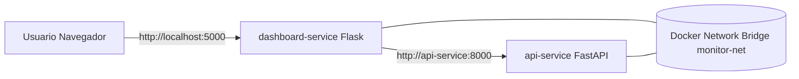

# MC Infrastructure Monitor

Aplicacion distribuida basada en contenedores Docker para monitorear el estado de servidores Linux y Windows.

## Objetivo del prototipo

Este proyecto implementa dos servicios desacoplados que se comunican por una red Docker Bridge personalizada:

1. `api-service` (FastAPI): expone metricas del sistema.
2. `dashboard-service` (Flask): consume la API y muestra un dashboard web.

La comunicacion entre servicios se realiza por nombre DNS interno de Docker (`http://api-service:8000`) dentro de la red `monitor-net`.

## Arquitectura



## Componentes

### Servicio 1: API REST

- Tecnologia: FastAPI + Uvicorn
- Puerto interno: `8000`
- Funcion principal: recopilar metricas del sistema con `psutil`
- Endpoints principales:
	- `GET /api/status`
	- `GET /api/system`
	- `GET /api/cpu`
	- `GET /api/memory`
	- `GET /api/disk`
	- `GET /api/network`
	- `GET /api/processes?limit=10`
	- `GET /api/history?limit=50`

### Servicio 2: Dashboard Web

- Tecnologia: Flask + HTML/CSS/JS + Chart.js
- Puerto publicado al host: `5000`
- Funcion principal: visualizar metricas consumiendo la API por proxy interno
- Rutas proxy internas:
	- `GET /api/proxy/system`
	- `GET /api/proxy/cpu`
	- `GET /api/proxy/memory`
	- `GET /api/proxy/disk`
	- `GET /api/proxy/network`
	- `GET /api/proxy/processes`

## Red Docker Bridge personalizada

En `docker-compose.yml` se define la red:

- Nombre: `monitor-net`
- Driver: `bridge`
- Subred: `172.25.0.0/16`
- Gateway: `172.25.0.1`

Esto garantiza aislamiento de red y resolucion de nombres entre contenedores sin exponer la API al exterior.

## Administracion de recursos

Cada servicio tiene limites de CPU y memoria en Compose:

- `api-service`: `cpus: 1.0`, `mem_limit: 512m`, `mem_reservation: 256m`
- `dashboard-service`: `cpus: 0.5`, `mem_limit: 256m`, `mem_reservation: 128m`

Adicionalmente se configuraron:

- `healthcheck` en ambos contenedores
- `depends_on` con `condition: service_healthy` para garantizar orden de arranque
- politica de reinicio `unless-stopped`

## Metricas historicas persistentes

La API guarda snapshots periodicos en una base de datos SQLite persistente:

- Base de datos: `/app/data/metrics.db`
- Persistencia Docker: volumen `api-data`
- Frecuencia de captura: variable `SNAPSHOT_INTERVAL_SECONDS` (por defecto 30s)
- Endpoint de lectura historica: `GET /api/history?limit=50`

Cada registro almacena timestamp, host, CPU, memoria, disco, red y total de procesos.

## Requisitos

- Docker 20.10+
- Docker Compose v2+

## Estructura del proyecto

```text
.
|-- docker-compose.yml
|-- Readme.md
|-- api-service
|   |-- app.py
|   |-- monitor.py
|   |-- Dockerfile
|   `-- requirements.txt
`-- dashboard-service
		|-- app.py
		|-- Dockerfile
		|-- requirements.txt
		`-- templates
				`-- index.html
```

## Construccion y despliegue

Desde la raiz del proyecto:

```bash
docker compose up --build -d
```

Verificar estado:

```bash
docker compose ps
```

## Pruebas funcionales

### 1. Verificar API desde el contenedor dashboard

```bash
docker compose exec dashboard-service python -c "import requests; print(requests.get('http://api-service:8000/api/system', timeout=5).status_code)"
```

Debe responder `200`.

### 2. Verificar dashboard web

Abrir en navegador:

- `http://localhost:5000`

### 3. Verificar red bridge personalizada

```bash
docker network inspect monitor-net
```

Debe mostrar ambos contenedores conectados a la misma red.

### 4. Verificar persistencia historica

```bash
docker compose exec api-service python -c "import sqlite3; c=sqlite3.connect('/app/data/metrics.db'); print(c.execute('select count(*) from metrics_history').fetchone()[0])"
```

Debe mostrar un valor mayor a 0 despues de algunos segundos.

## Comandos utiles

Ver logs:

```bash
docker compose logs -f api-service
docker compose logs -f dashboard-service
```

Detener y eliminar contenedores:

```bash
docker compose down
```

Detener y eliminar contenedores + red + volumenes anonimos:

```bash
docker compose down -v
```

## Consideraciones tecnicas

- El dashboard no llama a `localhost:8000`; usa `http://api-service:8000` por DNS interno de Docker.
- La API trabaja como servicio independiente y no depende del frontend.
- El diseño es escalable: se pueden agregar mas APIs o dashboards en la misma red bridge.

## Resultado esperado

Al ejecutar el sistema:

1. Se crean dos contenedores aislados (`mc-api-service` y `mc-dashboard`).
2. Ambos se comunican por la red bridge `monitor-net`.
3. El usuario visualiza metricas del servidor en `http://localhost:5000`.
4. El sistema conserva metricas historicas en SQLite aunque se reinicien contenedores.

## Evidencias de entrega academica

Se incluye una rubrica editable en `RUBRICA_EVIDENCIAS.md` con:

- Criterios tecnicos
- Comandos de verificacion
- Evidencia esperada
- Puntaje sugerido
